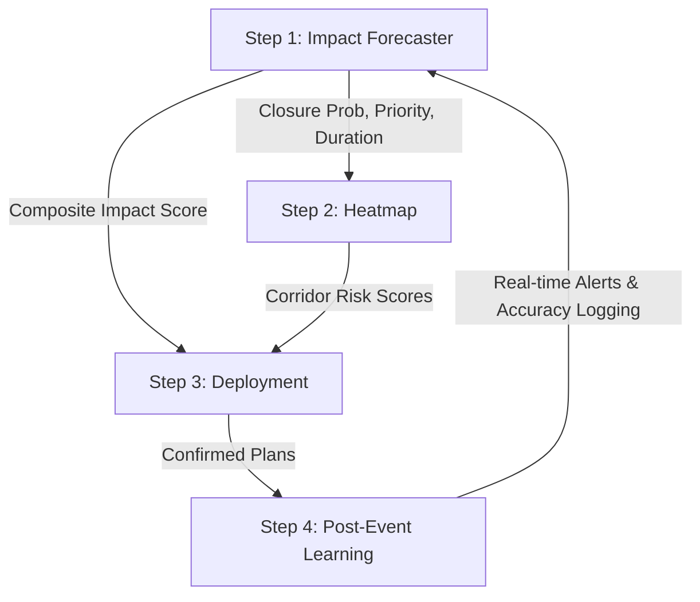

# EVAC System Implementation Guide

This document explains the implementation of all 4 steps of the EVAC System (Theme 2 Data-Grounded Edition), allowing anyone to understand the architecture, data flow, and components of the system.

## Overview
The EVAC System is built around 4 core modules that process anonymized historical traffic event data. The system uses real data (Astram event data) to provide impact forecasts, congestion hotspots, deployment recommendations, and anomaly detection.

### 1. Incident Impact Forecaster (Person 1)
**Goal:** Predict the severity and duration of any incoming incident.
- **Data & Features:** Uses engineered features based on the incident cause, location (corridor/zone), time of day, and vehicle type.
- **Models:** Two scikit-learn binary classifiers (for closure probability and priority) and a regressor (for incident duration). The predictions are aggregated into a composite impact score (1-10).
- **Outputs:** An impact score that feeds into the heatmap (Step 2) and deployment (Step 3).

### 2. Congestion Heatmap & Spatial Analysis (Person 2)
**Goal:** Identify where congestion is concentrated and assess the baseline risk of corridors.
- **Data & Features:** Operates on raw coordinates (`latitude`/`longitude`). It does not rely heavily on sparsely populated named junction fields.
- **Models:** 
  - **DBSCAN:** Clusters raw locations to find high-density hotspot zones.
  - **Kernel Density Estimation (KDE):** Creates a smoothed heatmap layer, weighted by the impact score provided by Step 1.
- **Outputs:** Precomputed hotspot zones and corridor risk scores.

### 3. Deployment Recommendation Engine (Person 3)
**Goal:** Translate predicted impact into concrete field deployment plans.
- **Data & Features:** Operates on a response-template rule table since historical deployment data is too sparse to train a model. 
- **Models:** A clear, rules-based engine that scales the number of officers based on the composite impact score (from Step 1) and baseline corridor risk (from Step 2). OpenStreetMap (OSMnx) is used for computing actual detour routes around closed segments.
- **Outputs:** Specific deployment templates including officer counts and barricade placements.

### 4. Anomaly Detection & Post-Event Learning (Person 4)
**Goal:** Detect live, unplanned spikes and monitor system accuracy over time.
- **Data & Features:** In the absence of a real-time data stream, historical CSV data is replayed sequentially to simulate a live event feed. A rolling 90-day baseline establishes normal expected event volume per corridor per hour.
- **Models:** 
  - **Isolation Forest:** Flags event volume spikes that deviate from the established baseline.
  - **Post-Event Comparator:** Logs the Step 1 predictions (priority, closure, duration) against the actual resolved outcomes from the dataset to calculate accuracy metrics.
- **Outputs:** Real-time alerts for anomalies and continuous accuracy metrics for system performance.

---

## Inter-Feature Data Flow

## Running the Components

All ML components are located in the `ml/` directory.

- **Notebooks (`ml/notebooks/`)**: Interactive EDA notebooks demonstrating data exploration and model training logic for each step.
- **Models (`ml/models/`)**: Contains the core classes and pre-trained `.joblib` files (e.g., `dbscan_model.joblib`, `kde_model.joblib`, `anomaly_detector.py`).
- **Pipelines (`ml/pipelines/`)**: Run `historical_replay_simulator.py` to see the Step 4 anomaly detection in action on the replayed dataset.

> **Note**: The backend APIs and frontend UIs are decoupled and will be integrated once the ML foundations (detailed above) are stable.
